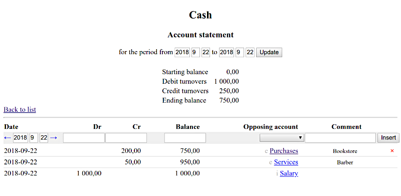

# debs
A simple web-based double-entry bookkeeping system.

## Overview
The system supports all basic account types, and deals with arbitrary
big numbers with exact integer arithmetic. Database can be encrypted.

## Requirements
The program is a WSGI application written in Python 3. If available, it
uses SQLCipher for data storage. Otherwise, it defaults to plain SQLite.

## Configuration
`DB` environment variable must contain a path to the database file.

## Caveat
For performance reasons, the program does not support SQLCipher
passphrases, and asks instead for raw keys, expected as 64-character
strings of hexadecimal digits.

## Screenshots
### The list of accounts:

### An account page:

## Customization
Decimal point, thousand separator, and the stylesheet are easily
customized.

## Compliance
The program produces HTML5 markup with a CSS3 style sheet.

## License
MIT.
