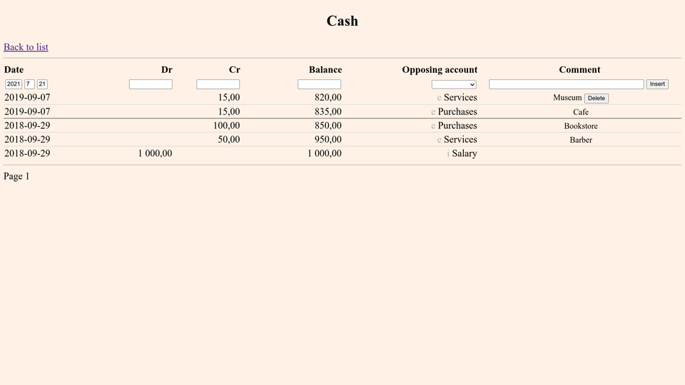

# debs
A simple web-based double-entry bookkeeping system.

## Features
The system supports all basic account types, and works with arbitrary
big numbers using exact integer arithmetic.

## Requirements
The program is written in Python 3 and intended to be run by a web
server as a WSGI application. It uses SQLite for data storage.

## Install
Arrange your web server to run the program as a WSGI application. Put
the database file wherever you like, only make sure the database file
and its parent directory are writable by the user from whom the web
server is running. In the Python source set the path to the database
file. You might also wish to modify thousand and decimal separators to
match your locale.

## Screenshots
### The list of accounts:

### An account page:

## License
MIT.
