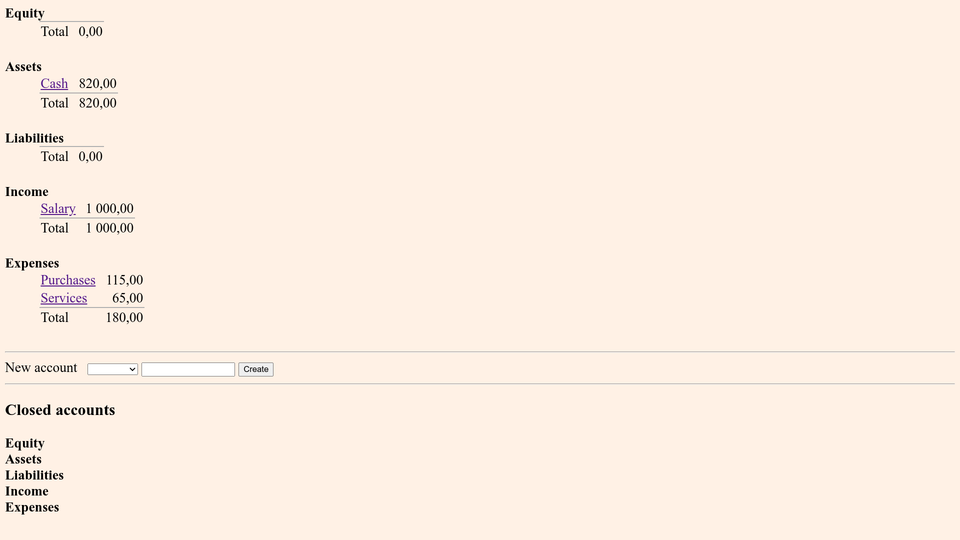

# debs
A simple web-based double-entry bookkeeping system.

## Features
The system supports all basic account types, and works with arbitrary
big numbers using exact integer arithmetic.

## Requirements
The program is written in Python 3 and intended to be run by a web
server as a WSGI application. It uses SQLite for data storage.

## Install
Arrange your web server to run the program as a WSGI application. Put
the database file wherever you like, only make sure the database file
and its parent directory are writable by the user from whom the web
server is running. Pass the database file location to the program in the
`DB` environment variable.

## Screenshots
### The list of accounts:

### An account page:

## Usage
The interface is quite straightforward, and it should be evident how to
create accounts and enter transactions. Perhaps it's worth to say that
all monetary input fields — Debit, Credit and Balance — accept arbitrary
complex arithmetic expressions.

## Customization
You can easily change thousand and decimal separators, and CSS style.
They are set just at the beginning of the Python code.

## Compliance
The program produces HTML5 markup with a CSS3 style sheet.

## License
MIT.
